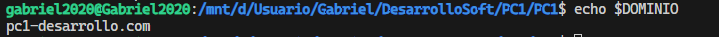

# PC1 - Automatizador de Despliegues DevSecOps

Automatizador para despliegues validados con HTTPS/TLS, siguiendo principios DevOps y 12-Factor App.

[Videos de los Sprints](https://drive.google.com/drive/folders/1sBFhOYXteBm7EsB3Ir6Fi5B56fCN-1bH?usp=sharing)
## Características

- **Validación automática** de configuración (grep/sed/cut)
- **Logging integrado** con journalctl (systemd)
- **Monitoreo de procesos** en tiempo real
- **Gestión de permisos** y grupos de usuario
- **Certificados TLS** autofirmados para HTTPS
- **Tests automatizados** con Bats
- **Limpieza automática** al finalizar

## Requisitos Previos

### Sistema Operativo

- **Linux** (Ubuntu/Debian recomendado)
- **WSL** (Windows Subsystem for Linux) si estás en Windows

### Herramientas Necesarias

```bash
# Verificar e instalar herramientas automáticamente
make tools
```

**Herramientas incluidas:**

- `curl` - Requests HTTP
- `dig` - Consultas DNS  
- `ss` - Estado de puertos
- `nc` - Testing de red
- `bats` - Framework de testing
- `nohup` - Procesos en background
- `systemd-cat` - Logging al sistema
- `grep/sed/cut` - Toolkit de procesamiento (incluidos por defecto)

## Instalación

### 1. Clonar el repositorio

```bash
git clone <repository-url>
cd PC1
```

### 2. Configurar entorno

```bash

# Crear archivo de configuración
cp .env.example .env
# Editar .env con tus valores
```

### 3. Configuración (.env)

```bash
PORT=60000
IP=127.0.0.1
DOMINIO=pc1-desarrollo.com
RELEASE=1.0.0
```

## Variables de entorno

El archivo `.env` centraliza la configuración para el despliegue y la miniapp Flask.

| Nombre      | Descripción                                                        | Ejemplo                      |
|-------------|--------------------------------------------------------------------|------------------------------|
| PORT        | Puerto donde se expone la miniapp Flask                            | 60000                        |
| IP          | Dirección IP de escucha (usualmente para pruebas locales)          | 127.0.0.1                    |
| MESSAGE     | Mensaje de despliegue que puede mostrar la app                     | Despliegue                   |
| RELEASE     | Versión del despliegue                                             | 1.0.0                        |
| DNS_SERVER  | Servidor DNS a usar en pruebas                                     | 8.8.8.8                      |
| DOMINIO     | Dominio personalizado que se asigna a localhost para pruebas       | pc1-desarrollo.com           |

#### Ejemplo de uso y salida

Si en `.env` tienes:

```env
DOMINIO=pc1-desarrollo.com
```

Y ejecutas en bash:

```sh
echo $DOMINIO
```

La salida será:



## Uso

### Comandos Principales

```bash
# Ejecutar despliegue completo
make run

# Verificar herramientas
make tools

# Ejecutar tests solamente
make test

# Limpiar artefactos
make clean

# Ver ayuda
make help
```

## Monitoreo y Logs

### Ver logs del sistema (journalctl)

```bash
# Ver solo errores críticos
journalctl -t pc1-deploy -p err

# Ver advertencias y errores
journalctl -t pc1-deploy -p warning

# Ver todo (incluyendo info)
journalctl -t pc1-deploy -p info

# Ver logs en tiempo real
journalctl -t pc1-deploy -f
```

### Logs de aplicación

```bash
# Ver logs de Flask
tail -f flask.log

# Ver logs de tests HTTP
cat out/http_logs.txt
```

## Testing

### Tests Automáticos

Los tests se ejecutan automáticamente durante el despliegue:

- **GET /** - Endpoint principal
- **GET /items** - Lista de items (JSON)
- **PUT /items/99** - Modificar item inexistente (404)
- **DELETE /items/99** - Eliminar item inexistente (404)

### Ejecutar tests manualmente

```bash
# Solo tests
make test

# Tests específicos con Bats
bats tests/http.bats
```

## Comandos Útiles

### Gestión de dominio

```bash
# Ver entradas en /etc/hosts
grep pc1-desarrollo.com /etc/hosts

# Limpiar dominio manualmente
sudo sed -i "/127.0.0.1 pc1-desarrollo.com/d" /etc/hosts
```

### Verificación de certificados

```bash
# Ver certificado generado
openssl x509 -in miniapp_flask/certs/server.crt -text -noout

# Verificar conexión HTTPS
curl -k https://pc1-desarrollo.com:60000/
```

## Solución de Problemas

### Error: "Puerto ocupado"

```bash
# Ver qué proceso usa el puerto
ss -ltnp | grep :60000

# Matar proceso que usa el puerto
sudo fuser -k 60000/tcp
```

### Error: "Sin permisos sudo"

```bash
# Agregar usuario al grupo sudo
sudo usermod -aG sudo $USER

# Recargar grupos
newgrp sudo
```

## Estructura del Proyecto

```
PC1/
├── Makefile              # Comandos de automatización
├── .env                  # Configuración (crear desde .env.example)
├── .env.example          # Plantilla de configuración
├── src/
│   ├── deploy.sh         # Script principal de despliegue
│   └── check_tools.sh    # Verificador de herramientas
├── tests/                # Tests automáticos
│   ├── http.bats         # Tests HTTP/HTTPS
│   ├── dns.bats          # Tests DNS
│   └── tls.bats          # Tests TLS/certificados
├── miniapp_flask/
│   ├── app.py            # Aplicación Flask
│   ├── requirements.txt  # Dependencias Python
│   └── certs/            # Certificados TLS (generados automáticamente)
│       ├── server.key    # Clave privada TLS
│       └── server.crt    # Certificado TLS
├── out/                  # Logs y artefactos (generado automáticamente)
│   ├── http_*.txt     # Logs de pruebas HTTP
│   ├── dns_a.txt         # Resultados DNS tipo A
│   ├── dns_cname.txt     # Resultados DNS tipo CNAME
│   └── tls_*.txt         # Logs de pruebas TLS
├── docs/                 # Documentación del proyecto
│   ├── README.md         # Documentación técnica detallada
│   ├── bitacora-sprint-1.md  # Bitácora del Sprint 1
│   ├── bitacora-sprint-2.md  # Bitácora del Sprint 2
│   ├── bitacora-sprint-3.md  # Bitácora del Sprint 3
│   └── videos/           # Videos avances del proyecto
├── venv/                 # Entorno virtual Python (generado)
├── flask.log             # Log de la aplicación Flask
└── flask_app.pid         # PID del proceso Flask
```
