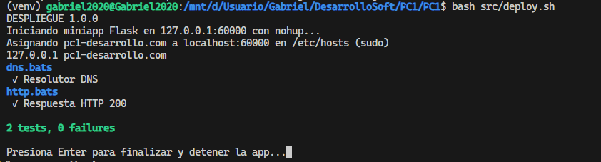
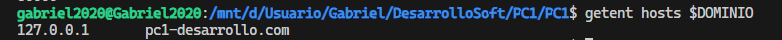
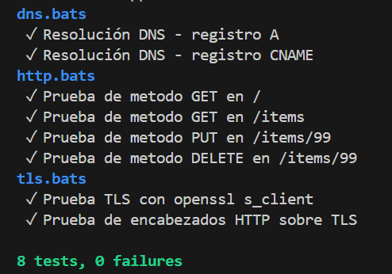

# Bitácora Sprint 2

En el Sprint 2 se integraron tres piezas clave: el script de automatización para el despliegue, la miniapp Flask y los tests automáticos. Ahora es posible levantar la aplicación y validar su funcionamiento de principio a fin con un solo comando, sin pasos manuales ni configuraciones ocultas.

## Comandos principales utilizados

### Makefile

El comando principal es `make run`, que ejecuta el script `src/deploy.sh`. Este script se encarga de todo el proceso de despliegue local de la miniapp Flask y valida que la configuración de HTTP, TLS y DNS sea la correcta.

El flujo de trabajo del script incluye:

1. Cargar las variables de entorno desde `.env`.
2. Generar un certificado TLS autofirmado si no existe, usando `openssl`.
3. Iniciar la miniapp Flask en segundo plano con `nohup`.
4. Agregar el dominio personalizado (`DOMINIO`) a `/etc/hosts` apuntando a `127.0.0.1` (requiere permisos de superusuario).
5. Ejecutar los tests automáticos con `bats`.
6. Al finalizar, limpiar el proceso y la entrada correspondiente en `/etc/hosts`.

#### Ejemplo de ejecución

```sh
./src/deploy.sh
```

#### Salidas esperadas

Durante la ejecución, se muestran mensajes con la versión de despliegue, el inicio de la miniapp Flask y la asignación del dominio al localhost. Si todo está correctamente configurado, los tests pasan y el dominio responde en localhost.

<p align="center">
 
</p>

## Validación de dominio apuntando a localhost

Para comprobar que el dominio definido en `.env` apunta a localhost, se utiliza el siguiente comando en bash/WSL:

```sh
getent hosts $DOMINIO
```

La salida esperada muestra la IP 127.0.0.1 asociada al dominio:

<p align="center">
 
</p>

## Pruebas automáticas

Las pruebas automáticas están implementadas con Bats en la carpeta `tests/`. Estas validan el funcionamiento del servidor HTTPS y la configuración DNS/TLS. Cuando se realizan solicitudes HTTPS con certificados autofirmados, se utiliza el flag `-k` en `curl` para permitir la conexión, ya que el certificado no está firmado por una autoridad reconocida.

### Pruebas HTTP
**1. Prueba de método GET en /**
- Envía una petición GET a la raíz / de la API.
- Guarda la respuesta en un log.
- Comprueba que el código de estado HTTP es 200 (OK).

**2. Prueba de método GET en /items**

- Envía una petición GET a /items.
- Guarda la respuesta en un log.
- Comprueba que el código de estado HTTP es 200.
- Verifica que la respuesta incluye:
- Content-Type: application/json
- Al menos un item con "id": 1.

**3. Prueba de método PUT en /items/99**

- Envía una petición PUT a /items/99 con un JSON de ejemplo {"nombre":"nuevo"}.
- Guarda la respuesta en un log.
- Verifica que el código de estado es 404.

**4. Prueba de método DELETE en /items/99**

- Envía una petición DELETE a /items/99.
- Guarda la respuesta en un log.
- Verifica que el código de estado es 404.

### Pruebas DNS
**Resolución DNS - registro A:** Verifica que el dominio resuelva a una IP IPv4 válida y guarda el resultado en /out/dns_a.txt.

**Resolución DNS - registro CNAME:** Comprueba la existencia de un registro CNAME para el dominio y guarda la salida en /out/dns_cname.txt.

### Pruebas TLS
**Prueba TLS con openssl s_client:** Establece conexión TLS con el dominio usando openssl, guarda la salida en /out/tls_openssl.txt y valida que se reporte el protocolo TLS.

**Prueba de encabezados HTTP sobre TLS:** Usa curl para obtener encabezados HTTPS del dominio, guarda la respuesta en /out/tls_curl_headers.txt y verifica que exista una respuesta HTTP válida.

### Ejemplo de salida de test

<p align="center">
 
</p>

## Decisiones y aprendizajes

- Se priorizó la automatización total del despliegue y las pruebas para evitar errores manuales.
- Se implementó la validación de dominio y certificados TLS, empleando certificados autofirmados y el flag `-k` en las pruebas HTTPS.
- Se aprendió la importancia del orden en la carga de variables y la generación de certificados antes de iniciar los servicios.
