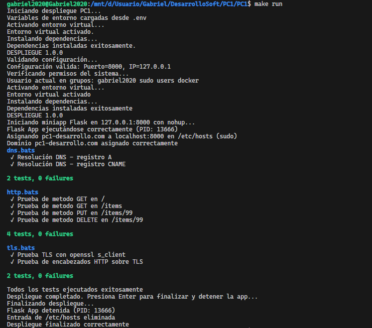

# Bitácora Sprint 3

En el Sprint 3 se realizó la verificación final del proyecto para asegurar que estuviera listo para entrega. Se revisaron los últimos cambios pendientes y se realizó la integración final a la rama main.

## Actividades realizadas

### Verificación de cambios pendientes

- Revisión de todas las ramas para identificar últimos cambios
- Verificación de que todas las funcionalidades estuvieran completas
- Comprobación de que la documentación estuviera actualizada

### Integración final

- Merge de develop hacia main mediante Pull Request
- Validación final de que todo funcionara correctamente

## Comandos utilizados

```bash
# Verificar estado del proyecto
git status
git log --oneline

# Crear Pull Request develop → main
git checkout develop
git pull origin develop

# Validar funcionamiento final
make run
make test
```

## Resultado

El automatizador quedó listo para la entrega con todas las funcionalidades implementadas y documentadas en los sprints anteriores.


